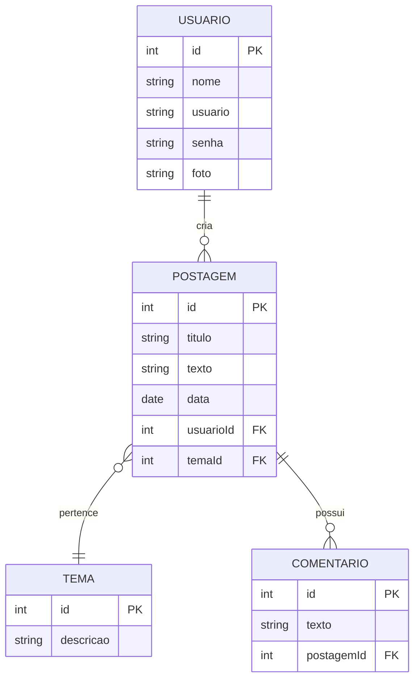

<p align="center">
  
</p>

<h1 align="center">📝 Blog Pessoal API</h1>

<p align="center">
  <em>API backend com NestJS focada em autenticação, segurança e gerenciamento de conteúdo</em>
</p>

<p align="center">
  
  
  
  
  
  
</p>

---

## 📖 Sobre o Projeto

API desenvolvida com **NestJS** para gerenciamento de um blog pessoal, com foco em **segurança e autenticação de usuários**.

O sistema permite cadastro, login e gerenciamento de conteúdos como **postagens, temas e comentários**, seguindo boas práticas de arquitetura backend.

---

## 🔐 Segurança

| Recurso | Descrição |
|--------|--------|
| 🔒 **Bcrypt** | Criptografia de senhas com hash seguro |
| 🔑 **JWT** | Autenticação stateless por token |
| 🛡️ **Guards** | Proteção de rotas autenticadas |
| 🧠 **Passport** | Estratégias de autenticação Local e JWT |

---

## ✨ Funcionalidades

| Recurso | Descrição |
|---|---|
| 👤 **Usuário** | Cadastro, atualização e busca |
| 🔐 **Login** | Autenticação com retorno de JWT |
| 📝 **Postagem** | CRUD completo |
| 🏷️ **Tema** | CRUD completo |
| 💬 **Comentário** | CRUD completo |
| 🔗 **Relacionamentos** | Usuário ↔ Postagem ↔ Tema ↔ Comentário |

---

## 🏗️ Estrutura do Projeto

```
src/
├── auth/
│   ├── bcrypt/
│   ├── constants/
│   ├── controllers/
│   ├── guard/
│   ├── services/
│   ├── strategy/
│   └── auth.module.ts
├── usuario/
├── postagem/
├── tema/
├── comentario/
└── app.module.ts
```

---

## 🗂️ Diagrama ER



---

## 🚀 Como Executar

### Pré-requisitos

- Node.js v20+
- MySQL v8+
- npm

### Instalação

```bash
# Clone o repositório
git clone https://github.com/seu-usuario/blogpessoal.git

# Acesse a pasta do projeto
cd blogpessoal

# Instale as dependências
npm install
```

### Rodando a aplicação

```bash
# Desenvolvimento (com hot reload)
npm run start:dev
```

> A API estará disponível em `http://localhost:4001`

---

## 🔗 Endpoints da API

### 👤 Usuário

| Método | Rota | Auth | Descrição |
|--------|------|------|-----------|
| `POST` | `/usuarios/cadastrar` | ❌ | Criar usuário |
| `POST` | `/usuarios/logar` | ❌ | Login |
| `GET` | `/usuarios` | ✅ | Listar usuários |
| `GET` | `/usuarios/:id` | ✅ | Buscar por ID |
| `PUT` | `/usuarios` | ✅ | Atualizar usuário |

### 📝 Postagem

| Método | Rota | Auth | Descrição |
|--------|------|------|-----------|
| `GET` | `/postagens` | ✅ | Listar postagens |
| `POST` | `/postagens` | ✅ | Criar postagem |
| `PUT` | `/postagens` | ✅ | Atualizar postagem |
| `DELETE` | `/postagens/:id` | ✅ | Deletar postagem |

### 🏷️ Tema

| Método | Rota | Auth | Descrição |
|--------|------|------|-----------|
| `GET` | `/temas` | ✅ | Listar temas |
| `POST` | `/temas` | ✅ | Criar tema |
| `PUT` | `/temas` | ✅ | Atualizar tema |

---

## 🔐 Autenticação

### Login

```http
POST /usuarios/logar
```

**Body:**
```json
{
  "usuario": "root@root.com",
  "senha": "123456"
}
```

**Resposta:**
```json
{
  "access_token": "eyJhbGciOiJIUzI1NiIsInR5cCI6IkpXVCJ9..."
}
```

**Uso nas rotas protegidas:**
```
Authorization: Bearer TOKEN_JWT
```

> ⚠️ Todas as rotas marcadas com ✅ exigem o token no header da requisição.

---

## 🧪 Testando com Insomnia

1. Crie uma nova **Workspace** chamada `Blog Pessoal API`
2. Adicione as requests com os métodos e URLs acima
3. Para `POST` e `PUT`, configure o body como **JSON**
4. Faça login em `/usuarios/logar` e copie o `access_token`
5. Nas rotas protegidas, adicione o header:
   ```
   Authorization: Bearer SEU_TOKEN_AQUI
   ```

---

## 🎯 Aprendizados

- ✅ Autenticação segura com **JWT**
- ✅ Criptografia de senhas com **Bcrypt**
- ✅ Arquitetura modular com **NestJS**
- ✅ Relacionamentos entre entidades com **TypeORM**
- ✅ Proteção de rotas com **Guards e Passport**

---

## 👩‍💻 Autora

**Lohanna B**  
Feito com 💜 e muito ☕

---

## 📄 Licença

Este projeto está sob a licença **MIT**. Veja o arquivo [LICENSE](LICENSE) para mais detalhes.
